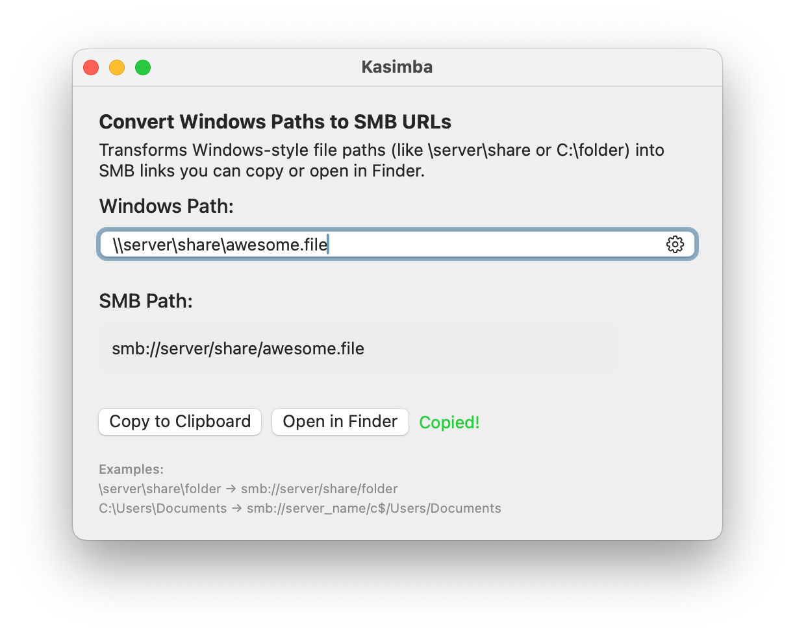

# Kasimba

A simple macOS application that converts Windows paths to SMB addresses. Useful for Mac users who need to access Windows network shares.

<p align="center">
  
</p>



## Features

- Convert UNC paths (\\\\server\\share\\folder) to SMB URLs (smb://server/share/folder)
- Convert Windows drive paths (C:\\folder\\file.txt) to SMB URLs with configurable server placeholder
- Copy converted paths to clipboard with a single click
- Open paths directly in Finder
- macOS keyboard shortcuts support (⌘⇧C to copy, ⌘O to open in Finder)
- Clean, modern interface built with SwiftUI

## Installation

### Option 1: Download Pre-built App
1. Download the latest release from the [Releases](https://github.com/yourusername/kasimba/releases) page
2. Open the DMG file and drag Kasimba to your Applications folder

### Option 2: Build from Source
1. Clone this repository
   ```
   git clone https://github.com/yourusername/kasimba.git
   cd kasimba
   ```
2. Open the project in Xcode
   ```
   open Kasimba.xcodeproj
   ```
3. Build the app (⌘B) and run (⌘R)

### Option 3: Create DMG Installer
1. Run the included DMG creation script
   ```
   chmod +x create_dmg.sh
   ./create_dmg.sh
   ```
2. The DMG will be created in the `build` directory

## How to Use

1. Launch the application
2. Enter a Windows path in one of these formats:
   - UNC path: `\\server\share\folder\file.txt`
   - Windows drive path: `C:\folder\file.txt`
3. The converted SMB path will automatically display
4. Use "Copy to Clipboard" (⌘⇧C) or "Open in Finder" (⌘O)

## Path Conversion Examples

| Windows Path | SMB Path |
|--------------|----------|
| `\\server\share\folder` | `smb://server/share/folder` |
| `C:\Users\Documents` | `smb://server_name/c$/Users/Documents` |

Note: For Windows drive paths (like C:), you can set a custom server name in the Settings.

## Requirements

- macOS 13.0 or later

## Contributing

Contributions are welcome! Please feel free to submit a Pull Request.

1. Fork the repository
2. Create your feature branch (`git checkout -b feature/amazing-feature`)
3. Commit your changes (`git commit -m 'Add some amazing feature'`)
4. Push to the branch (`git push origin feature/amazing-feature`)
5. Open a Pull Request

## License

This project is licensed under the MIT License - see the [LICENSE](LICENSE) file for details.

## Acknowledgments

- Built using SwiftUI
- Inspired by the need to easily access Windows paths on macOS 